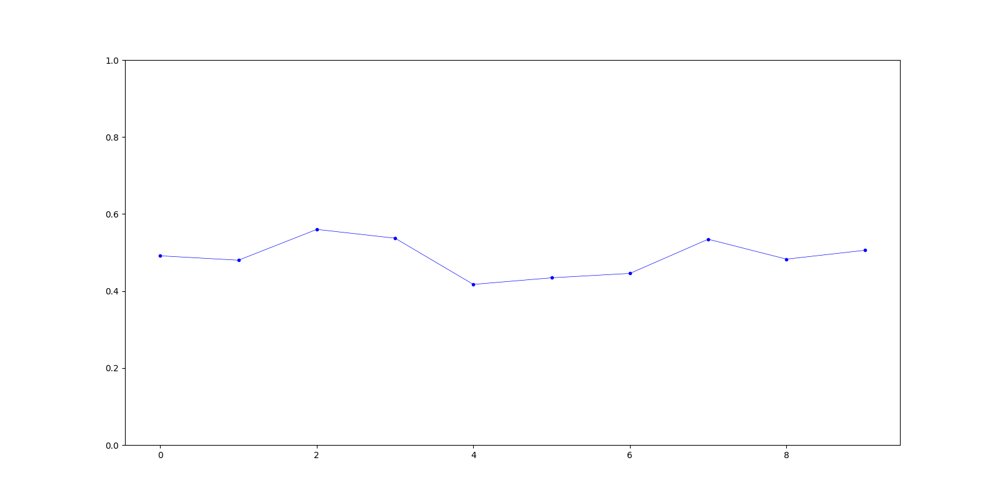

# breakstrat

## Strategies

### Baseline

### Trailstop

Trailstop is an extension of the baseline breakout strategy. The baseline strategy places a stop loss at a fixed level 
below the price at which a trade is entered. Trailstop instead uses a *trailing stop loss* based on a fixed percentage
below the most recent high.

To run a backtest of Trailstop `cd` into the project directory, and run the following command:

```
python -m strategies.trailstop.backtest
    --data_path=data/binance_spot_eth_usdt_5min.json
    --stop_coeff_initial=0.985
    --stop_coeff=0.99
    --target_coeff=1.15
    --terminal_num_periods=20
    --lookback=60
```

- `stop_coeff_initial` is the fraction that determines the stop loss of the first period (after entry). `stop_coeff` is
the fraction that determines the stop loss of subsequent periods. We found that setting an initial stop loss that is
slightly lower performed better.
- `target_coeff` is the fraction that determines the level at which to take profit. The level is based on the price
that a trade is entered at.
- `terminal_num_periods` is the maximum number of periods that a position is held for. If neither the target level nor 
the stop level is hit a trade is exited when the terminal number of periods is reached.
- `lookback` is used by the breakout detection algorithm. It determines the number of past periods required to establish
whether a breakout has occurred.

The output of a backtest is saved in directory of the form `runs/trailstop_[timestamp]`. The output includes the
following:

- `equity.png` is a plot of the cumulative return of the strategy over the backtest period (e.g. see figure 1). 
- `params.json` contains the strategy parameters of the backtest.
- `trades.csv` contains the performance of each trade (e.g. `gross_profit`).
- `summary.csv` summary of the overall performance of the strategy.

*Figure 1*


In order to improve a strategy it is important to visualize the decisions it makes. For this reason, we have also added
the option for the backtest to produce a plot of every single trade. In order to generate the plots add the 
``--with_plots`` flag e.g.

```
python -m strategies.trailstop.backtest
    --with_plots
    --data_path=data/binance_spot_eth_usdt_5min.json
    --stop_coeff_initial=0.985
    --stop_coeff=0.99
    --target_coeff=1.15
    --terminal_num_periods=20
    --lookback=60
```

Example of the type of plot produced:

*Figure 2*


## Research

### Probability of a true breakout

**Baseline probability**

| run_dir                         | data_path                            |   num_trades |   num_pos_trades |   num_neg_trades |   prob_true |
|:--------------------------------|:-------------------------------------|-------------:|-----------------:|-----------------:|------------:|
| runs/trailstop_1599403704228716 | data/binance_spot_eth_usdt_5min.json |          357 |              172 |              185 |    0.481793 |
| runs/trailstop_1599480765138089 | data/binance_spot_eth_usdt_1min.json |         1747 |              854 |              893 |    0.488838 |

The above table is saved in `research/results/baseline.md`. To produce this table run the following command:

```
python -m research.baseline --run_ids "[1599403704228716, 1599480765138089]"
```

Remarks:

- **The estimate of the probability of a true breakout is biased**. The estimate rests on the assumption that a true
breakout corresponds to a profitable trade (defined by *Trailstop*). However, there are a lot of examples of profitable
trades that intuitively we wouldn't want to classify as being true breakouts (see figure *). Despite this issue, the
current working definition does still provide a rough idea of the probability of a true breakout. More importantly,
**the definition is likely good enough to test whether certain features are predictive for a true breakout**.

**Volume as a feature**

In this section we investigate whether volume correlates with the probability of a breakout. *I.e. are certain values of
volume more likely to correspond to a true breakout than others?* The belief that we test is that a breakout on larger
volume is more likely to be a true breakout.

The results below are generating using the `python -m research.volume` command.

*Table 1*

| interval                 |   prob_true |   num_obs |
|:-------------------------|------------:|----------:|
| [33.46566, 335.43794]    |    0.491429 |       175 |
| [335.70169, 490.34579]   |    0.48     |       175 |
| [492.50678, 644.01946]   |    0.56     |       175 |
| [647.25991, 844.23584]   |    0.537143 |       175 |
| [844.36914, 1096.25991]  |    0.417143 |       175 |
| [1097.14934, 1437.49539] |    0.434286 |       175 |
| [1437.86022, 1907.82204] |    0.445714 |       175 |
| [1918.86553, 2880.75598] |    0.534483 |       174 |
| [2882.14951, 4722.58386] |    0.482759 |       174 |
| [4790.58909, 31713.3321] |    0.505747 |       174 |

The above table looks at the probability of a true breakout at different levels of volume. E.g. the first row shows
the (estimated) probability of a true breakout when the volume (at the time of breakout) is between is between 33.56566 
and 335.43794. The *num_obs* column displays the number of observations that went into estimating the probability.

*Figure 3*


This figure shows the same information as the above table. The values on the x-axis correspond to the row numbers of
the table; the y-axis to the probability of a true breakout.

*Figure 4*


The above figure is a histogram of the volume at breakout time for all trades. The red histogram corresponds to 
breakouts that were false (i.e. unprofitable). The blue histogram corresponds to true breakouts.

The results on `data/binance_spot_eth_usdt_5min` are similar. To view those results simply go into the
`research/results/volume_eth_usdt_5min` directory.

### Profitability of a true breakout

**Baseline profitability**


**Volume as a feature**


