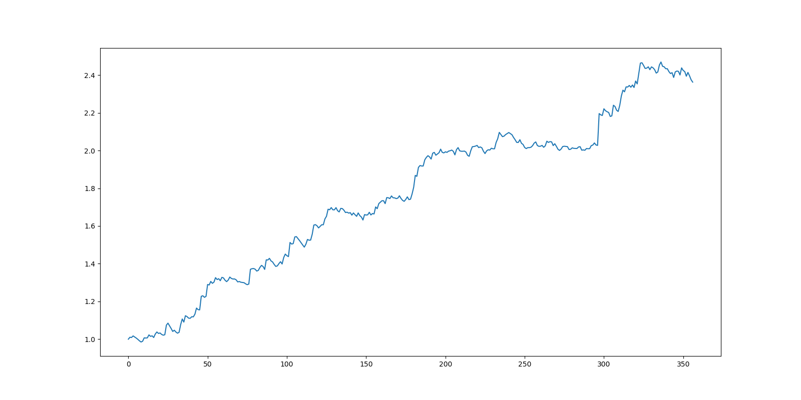
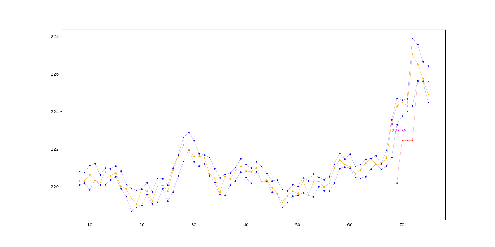

# breakstrat

## Strategies

### Baseline

### Trailstop

Trailstop is an extension of the baseline breakout strategy. The baseline strategy places a stop loss at a fixed level 
below the price at which a trade is entered. Trailstop instead uses a *trailing stop loss* based on a fixed percentage
below the most recent high.

To run a backtest of Trailstop `cd` into the project directory, and run the following command:

```
python -m strategies.trailstop.backtest
    --data_path=data/binance_spot_eth_usdt_5min.json
    --stop_coeff_initial=0.985
    --stop_coeff=0.99
    --target_coeff=1.15
    --terminal_num_periods=20
    --lookback=60
```

- `stop_coeff_initial` is the fraction that determines the stop loss of the first period (after entry). `stop_coeff` is
the fraction that determines the stop loss of subsequent periods. We found that setting an initial stop loss that is
slightly lower performed better.
- `target_coeff` is the fraction that determines the level at which to take profit. The level is based on the price
that a trade is entered at.
- `terminal_num_periods` is the maximum number of periods that a position is held for. If neither the target level nor 
the stop level is hit a trade is exited when the terminal number of periods is reached.
- `lookback` is used by the breakout detection algorithm. It determines the number of past periods required to establish
whether a breakout has occurred.

The output of a backtest is saved in directory of the form `runs/trailstop_[timestamp]`. The output includes the
following:

- `equity.png` is a plot of the cumulative return of the strategy over the backtest period (e.g. see figure 1). 
- `params.json` contains the strategy parameters of the backtest.
- `trades.csv` contains the performance of each trade (e.g. `gross_profit`).
- `summary.csv` summary of the overall performance of the strategy.

*Figure 1*


In order to improve a strategy it is important to visualize the decisions it makes. For this reason, we have also added
the option for the backtest to produce a plot of every single trade. In order to generate the plots add the 
``--with_plots`` flag e.g.

```
python -m strategies.trailstop.backtest
    --with_plots
    --data_path=data/binance_spot_eth_usdt_5min.json
    --stop_coeff_initial=0.985
    --stop_coeff=0.99
    --target_coeff=1.15
    --terminal_num_periods=20
    --lookback=60
```

Example of the type of plot produced:

*Figure 2*


