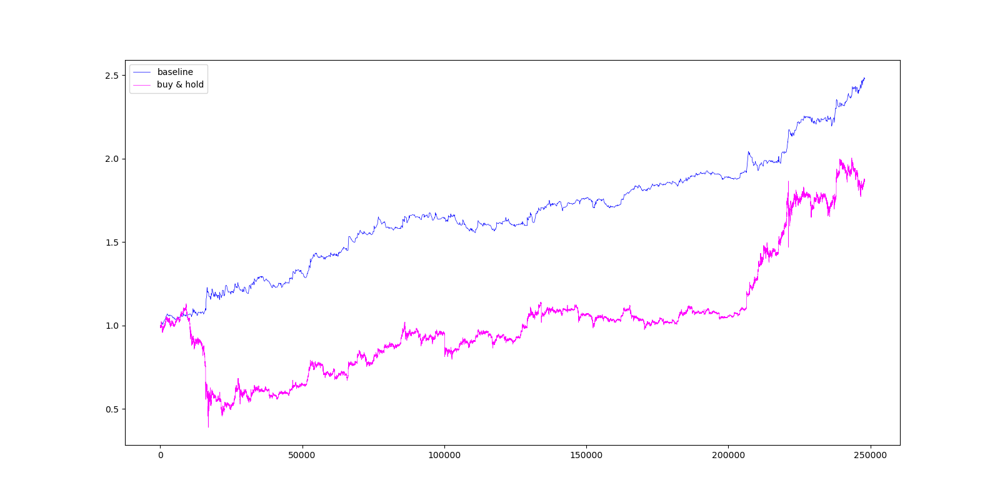
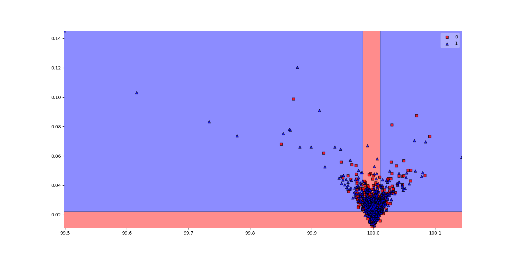

# breakstrat

## Table of contents

1. [Getting started](#introduction)
2. [Strategies](#strategies)
    1. [Baseline](#strategy_baseline)
    2. [Trailstop](#strategy_trailstop)
    3. [OUstop](#strategy_oustop)
3. [Research](#research)

## Getting started

To get started with running the code in this repository you need to install the dependencies listed in 
`requirements.txt`. Doing this is simply a matter of running the following command:

```pip install -r requirements.txt```

The above command should be enough to get code working. However, it is also recommended you use a conda environment.
Install conda from:

https://docs.anaconda.com/anaconda/install/

Then open a terminal and run:

```
conda create --name breakstrat
conda activate breakstrat
conda install pip
pip install -r requirements.txt
```

Make sure that your project interpreted points to the conda environment (e.g. *breakstrat*) you have created for this
repository.

## Todos

- **Incorporate fees** into backtesting.
- Add **additional evaluation metrics** (e.g. max drawdown, sharpe ratio).
- **Improve the figures** e.g. add labels and/ or usuful annotations.
- Find and add **different types of data** e.g. Google trends, Twitter, Reddit, news (e.g. Cointelegraph, Coindesk).
- Build a **pattern extraction** tool (e.g. like https://rickyhan.com/jekyll/update/2017/09/14/autoencoders.html). Certain price
formations before a breakout are possibly predictive of a true breakout. A pattern extraction tool can help
finding such (potentially) predictive patterns.
- Investigate **time as a feature**. There might be a relationship between the time between breakouts and the likelihood 
of a breakout being true. From experience it seems that if a breakout happens shortly after a breakout has already
happened, it is more likely to be false, or less profitable.
- Investigate **trend as a feature**. Is a (positive) breakout more likely to be true in an uptrend (e.g. when price is
above the n-period moving average)?
- Investigate whether a breakout closer to a moving average cross is more likely to be true. The figure below shows
an example (near the end of the moving average trend) of a price movement that our algorithm flags as a breakout that
ended up false.


## Strategies

### Baseline <a name="strategy_baseline"></a>

**Description**

The baseline strategy is based on a simple heuristic for identifying a breakout. The heuristic boils down to looking
at recent prices over a fixed time window, and comparing those prices to the current price. The current price level is 
classified as a breakout if the direction of change is positive and also significantly different from the price 
movements observed in the recent past (in our chosen time window).

For a precice definition of the heuristic used by the baseline strategy look at the `is_breakout` function in
`strategies/baseline/backtest.py`.

Once a breakout is detected the a **trade is entered**. Our current implementation assumes that a trade is entered (using a 
market order) at the close price of the period in which the breakout was detected. (In the future we will assume a 
limit order is placed at the level price needs to reach in order to be classified as a breakout.)
A trade is entered using a limit order.

There are three possible ways in which a **trade is exited**. We can either hit our **stop loss** or **target level**. 
In the case that neither levels are hit we exit after a **fixed number of time** has passed since we entered. 
The baseline sets a stop loss at a fixed percentage below the price the trade was entered at. Similarly, the take 
profit is set at a fixed percentage above the entry price.

**Results**

The commands to produce the results below has the form:

```
python -m strategies.baseline.backtest
    --data_path=<data_path>
    --lb=1.0
    --stop_coeff_initial=0.985
    --target_coeff=1.15
    --terminal_num_periods=20
    --lookback=60
``` 

Let `data_path = data/binance_spot_eth_usdt_1min.json` to produce the 1min ETHUSDT results, and 
`data_path = data/binance_spot_eth_usdt_1min.json` to produce the 5min ETHUSDT results.

- `lb` (short for *lowerbound*) determines how sensitive the breakout detection algorithm is. Higher values for `lb` 
require the difference between the current price vs. past prices to be more significant.
- `stop_coeff_initial` is the fraction to multiply the entry price by to get the stop loss level.
- `target_coeff` is the fraction that determines the level at which to take profit. The level is based on the price
that a trade is entered at.
- `terminal_num_periods` is the maximum number of periods that a position is held for. If neither the target level nor 
the stop level is hit a trade is exited when the terminal number of periods is reached.
- `lookback` is used by the breakout detection algorithm. It determines the number of past periods required to establish
whether a breakout has occurred.

The output of a backtest is saved in the directory specified by `--run_dir` (default `runs/trailstop_[timestamp]`).

*Table 1*

| data_path                            |   cum_return |   avg_return_per_trade |   num_trades |   num_pos_trades |   num_neg_trades |
|:-------------------------------------|-------------:|-----------------------:|-------------:|-----------------:|-----------------:|
| data/binance_spot_eth_usdt_1min.json |       2.2039 |                1.00046 |         1802 |              886 |              916 |
| data/binance_spot_eth_usdt_5min.json |      1.72312 |                1.00162 |          357 |              163 |              194 |

Running the baseline strategy with the above parameters gives a cumulative (gross) return of 2.2039 over the backtest
period (from: 2020-03-01T06:00:00Z until: 2020-08-20T20:12:00Z) on the 1min ETHUSDT dataset. On the 5min data the
return was 1.7312. On both datasets the **average return per trade is not large enough** to break-even when fees are
taken into account.

*Figure 1*


Figure 1 shows the cumulative return of the baseline strategy on the `data/binance_spot_eth_usdt_1min.json` dataset 
over the backtest period and compares it to the performance of just buying and holding.

*Figure 2*


This is an example of a trade made by the baseline algorithm. The red line is the stop loss level. The number in
magenta is the price the algorithm entered the trade at. To produce this plot run the `strategies/baseline/backtest.py`
module but with `--with_plots` flag included. E.g.

```
python -m strategies.baseline.backtest
    --with_plots
    --data_path=data/binance_spot_eth_usdt_5min.json
    --lb=1.0
    --stop_coeff_initial=0.985
    --target_coeff=1.15
    --terminal_num_periods=20
    --lookback=60
```

### Trailstop

**Description**

Trailstop is an extension of the baseline breakout strategy. The baseline strategy places a stop loss at a fixed level 
below the price at which a trade is entered. Trailstop instead uses a *trailing stop loss* based on a fixed percentage
below the most recent high.

**Results**

E.g. command used to produce backtest results:

```
python -m strategies.trailstop.backtest
    --data_path=data/binance_spot_eth_usdt_5min.json
    --stop_coeff_initial=0.985
    --stop_coeff=0.99
    --target_coeff=1.15
    --terminal_num_periods=20
    --lookback=60
```

- `stop_coeff_initial` is the fraction that determines the stop loss of the first period (after entry). `stop_coeff` is
the fraction that determines the stop loss of subsequent periods. We found that setting an initial stop loss that is
slightly lower performed better.
- All other parameters are the same as the baseline strategy.

*Table 1*

| data_path                            |   cum_return |   avg_return_per_trade |   num_trades |   num_pos_trades |   num_neg_trades |
|:-------------------------------------|-------------:|-----------------------:|-------------:|-----------------:|-----------------:|
| data/binance_spot_eth_usdt_1min.json |      2.48227 |                1.00052 |         1817 |              889 |              928 |
| data/binance_spot_eth_usdt_5min.json |      2.38982 |                1.00245 |          363 |              175 |              188 |


*Figure 1*



*Figure 2*


This is an example of a trade that was made by the trailstop algorithm. The red line is the stop loss level. Like the 
baseline strategy, in order to produce this plot make sure to run the backtest module with `--with_plots` included.

# Research

## Probability of a true breakout

### Baseline probability

| run_dir                         | data_path                            |   num_trades |   num_pos_trades |   num_neg_trades |   prob_true |
|:--------------------------------|:-------------------------------------|-------------:|-----------------:|-----------------:|------------:|
| runs/trailstop_1599403704228716 | data/binance_spot_eth_usdt_5min.json |          357 |              172 |              185 |    0.481793 |
| runs/trailstop_1599480765138089 | data/binance_spot_eth_usdt_1min.json |         1747 |              854 |              893 |    0.488838 |

The above table is saved in `research/results/baseline.md`. To produce this table run the following command:

```
python -m research.baseline --run_ids "[1599403704228716, 1599480765138089]"
```

Remarks:

- **The estimate of the probability of a true breakout is biased**. The estimate rests on the assumption that a true
breakout corresponds to a profitable trade (defined by *Trailstop*). However, there are a lot of examples of profitable
trades that intuitively we wouldn't want to classify as being true breakouts (see figure *). Despite this issue, the
current working definition does still provide a rough idea of the probability of a true breakout. More importantly,
**the definition is likely good enough to test whether certain features are predictive for a true breakout**.

### Volume as a feature

In this section we investigate whether volume correlates with the probability of a breakout. *I.e. are certain values of
volume more likely to correspond to a true breakout than others?* The belief that we test is that a breakout on larger
volume is more likely to be a true breakout.

The results below are generating using the `python -m research.volume` command.

*Table 1*

|     lb | volume_interval                 |   prob_true |   num_obs |
|-------:|:-------------------------|------------:|----------:|
| 1      | [33.46566, 321.89743]    |  0.478022   |       182 |
| 1      | [4603.93268, 31713.3321] |  0.508287   |       181 |
| 1.0025 | [33.46566, 335.12007]    |  0.141243   |       177 |
| 1.0025 | [4703.96199, 31713.3321] |  0.357955   |       176 |
| 1.005  | [33.46566, 335.43794]    |  0.0285714  |       175 |
| 1.005  | [4790.58909, 31713.3321] |  0.241379   |       174 |
| 1.01   | [33.46566, 335.43794]    |  0.0115607  |       173 |
| 1.01   | [4798.95866, 31713.3321] |  0.127907   |       172 |

The above table looks at the probability of a true breakout at different levels of volume. E.g. the first row shows
the (estimated) probability of a true breakout when the volume (at the time of breakout) is between is between 33.56566 
and 335.43794. The *num_obs* column displays the number of observations that went into estimating the probability.

*Figure 3*


This figure shows the same information as the above table. The values on the x-axis correspond to the row numbers of
the table; the y-axis to the probability of a true breakout.

*Figure 4*


The above figure is a histogram of the volume at breakout time for all trades. The red histogram corresponds to 
breakouts that were false (i.e. unprofitable). The blue histogram corresponds to true breakouts.

The results on `data/binance_spot_eth_usdt_5min` are similar. To view those results simply go into the
`research/results/volume_eth_usdt_5min` directory.

### Leveraging asset correlation

|     lb |   prob_true |   prob_true_common |   num_true_signals |   num_signals |   num_true_common_signals |   num_common_signals |
|-------:|------------:|-------------------:|-------------------:|--------------:|--------------------------:|---------------------:|
| 1      |    0.130985 |           0.150685 |                238 |          1817 |                        99 |                  657 |
| 1.0025 |    0.133144 |           0.155624 |                235 |          1765 |                       101 |                  649 |
| 1.005  |    0.133371 |           0.157321 |                233 |          1747 |                       101 |                  642 |
| 1.01   |    0.13476  |           0.157566 |                233 |          1729 |                       101 |                  641 |


### Learning from embeddings

In this section we are interested in answering the questions: **Is it possible to predict a true breakout using past
returns?** If we had a large enough dataset i.e. were most possible returns series preceding a breakout are observed 
(multiple times), then answering this question is relatively straightforward. To estimate the conditional 
(on past returns) probability of a true breakout, one could simply use a nearest neighbor approach. The density
(of data) in a neighborhood would be sufficient to get a reliable estimate.

Besides the neareset neighbor approach, there are numerous other conditional probability models that can be used to 
obtain an estimate. Regerdless of the method used, the reliability of our estimate relies heavily on the density of the 
data surrounding the corresponding returns series.

There are two main factors that affect the density of data: (1) The dimensionality of our returns series, and (2) the 
amount of data we have. In this section we will focus on the first issue: dimensionality. In particular, we will **focus
on finding alternative lower dimensional representations** (i.e. embeddings) of returns. The **aim is to create 
embeddings that are a good enough summary of the orginal returns series**, whilst having a much lower dimensionality, 
therefore signficantly improving the density of our data.

#### GBM

The first approach we try out maps any series into a 2-dimensional representation. The rule is extremely simple. We
just **look at the mean and standard deviation of the returns that make up a returns series**. The mean and standard deviation
are sufficient statistics for estimating the parameters of a Geometric Brownian Motion (GBM). The GBM is a stochastic
process that is a simple (but commonly used) model for financial time series 
(see https://en.wikipedia.org/wiki/Geometric_Brownian_motion).

Using the above idea we convert all return sequences to 2-dimensional feature vectors. We then **use a decision tree
to segment this feature space into regions of different probability of (true) breakout**. Before fitting the decision
tree the data is **down-sampled** to make the number of false breakouts equal to the number of true breakouts in the data.
(The number of false breakouts overwhelms the number of true breakouts. Without down-sampling the decision tree is
unable to segment the feature space. Every point in the feature space ends up being classified as a false breakout.)

**Results**

The results below are produced by running:

```
python -m research.embed
    --symbol=binance_spot_eth_usdt_1min
    --embedder_type=gbm
    --max_depth=4
    --min_samples_leaf=60
    --lb_return=1.002
``` 

*Figure 1*



The segmentation of the feature space learned by the decision tree (on down-sampled data). Blue dots correspond to
true breakouts; red dots to false breakouts. The blue regions correspond to areas where the probability of a true
breakout is higher than average.

*Table 1*

|   group |   prob_pos |   num_pos |   num_obs |   avg_return_per_trade |
|--------:|-----------:|----------:|----------:|-----------------------:|
|      11 |   0.358804 |       324 |       903 |                1.00115 |
|      13 |   0.48951  |        70 |       143 |                **1.00224** |
|       7 |   0.5      |        66 |       132 |                **1.00372** |
|      14 |   0.382716 |        31 |        81 |                1.0026  |
|      10 |   0.430233 |        37 |        86 |                1.00201 |
|       3 |   0.203704 |        22 |       108 |                1.00033 |
|       5 |   0.336066 |        41 |       122 |                1.00128 |
|       4 |   0.168605 |        29 |       172 |                1.00009 |

The decision tree segements the feature space into multiple regions (or groups). In the above table group 13 and 7 are
notable. The reason is that the average return of a trade in those regions is larger than 1.002; as such, **are profitable
in the long run**. 

*Table 2*

|   prob_true_given_pred_pos |   prob_neg_given_pred_neg |   prob_pos |   prob_neg |   num_obs |   num_pos |   num_neg |   num_pred_pos |   num_pred_neg |   num_true_pos_and_pred_pos |   num_true_neg_and_pred_neg |
|---------------------------:|--------------------------:|-----------:|-----------:|----------:|----------:|----------:|---------------:|---------------:|----------------------------:|----------------------------:|
|                   0.461538 |                  0.681226 |   0.354894 |   0.645106 |      1747 |       620 |      1127 |            442 |           1305 |                         204 |                         889 |

This table shows the probability of a breakout conditional on the predictions made by the decision tree (used to 
segment the feature space). E.g. If the decision tree predicts a returns series corresponds to a true breakout, there
is a 46.1% chance that this is indeed the case.

**Caveat(s)**:

- The results are for the training data. Performance on unseen data is yet to be determined.
- The number of observations in each group is small; arguably not enough to be confident.

#### GBMSplit

Our GBM method can be a bit crude in representing a return series. The problem, especially for longer series, is that
the underlying process that generates returns tends to change after a certain period of time. In this case, using a
single GBM may not be expressive enough. To remedy this issue we try out a simple extension. We **split** our returns
series into two pieces (down the middle). We then calculate the mean and standard deviation of each piece seperately.
The mean and standard deviation of each piece are then combined (into a single vector) to create a 4-dimensional 
representation of the original return series.

Note: The decision to split the returns series down the middle is a crude heuristic. Ideally, the point to split at
should be at a **change point**. (For a definition and examples of the term *change point* see 
https://tinyurl.com/yxrp2n7k). Implementing a change point detection algorithm is a possible future extension of 
*GBMSplit*.

**Results**

|   group |   prob_pos |   num_pos |   num_obs |   avg_return_per_trade |
|--------:|-----------:|----------:|----------:|-----------------------:|
|      17 |   0.361878 |       262 |       724 |                1.00097 |
|      20 |   0.551402 |        59 |       107 |                1.00372 |
|      19 |   0.403846 |        42 |       104 |                1.00147 |
|      13 |   0.594595 |        44 |        74 |                1.00655 |
|      10 |   0.308176 |        49 |       159 |                1.00091 |
|      11 |   0.214286 |        18 |        84 |                1.00018 |
|       4 |   0.227273 |        20 |        88 |                1.00027 |
|       8 |   0.396552 |        46 |       116 |                1.0017  |
|      16 |   0.442105 |        42 |        95 |                1.00205 |
|       6 |   0.284211 |        27 |        95 |                1.00116 |
|       5 |   0.108911 |        11 |       101 |                1.00013 |


|   prob_true_given_pred_pos |   prob_neg_given_pred_neg |   prob_pos |   prob_neg |   num_obs |   num_pos |   num_neg |   num_pred_pos |   num_pred_neg |   num_true_pos_and_pred_pos |   num_true_neg_and_pred_neg |
|---------------------------:|--------------------------:|-----------:|-----------:|----------:|----------:|----------:|---------------:|---------------:|----------------------------:|----------------------------:|
|                   0.405738 |                  0.762808 |   0.354894 |   0.645106 |      1747 |       620 |      1127 |           1220 |            527 |                         495 |                         402 |

